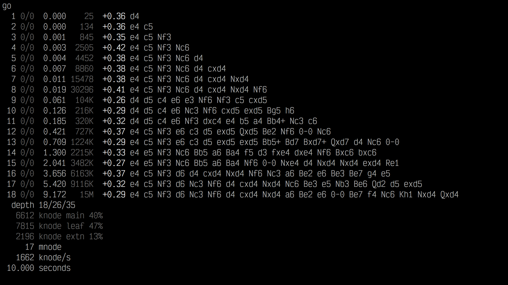
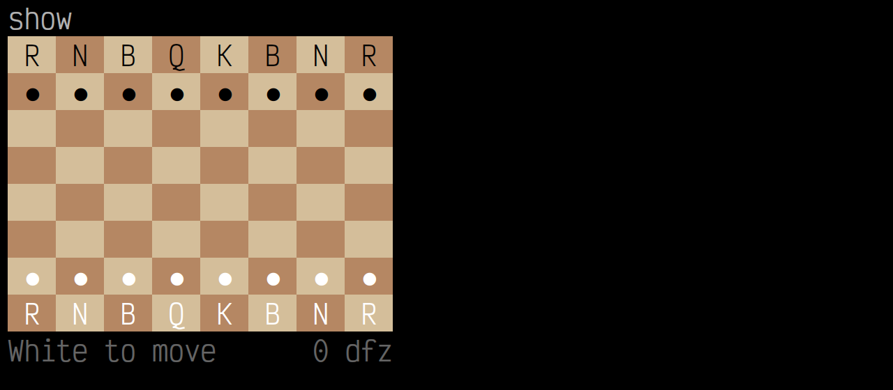
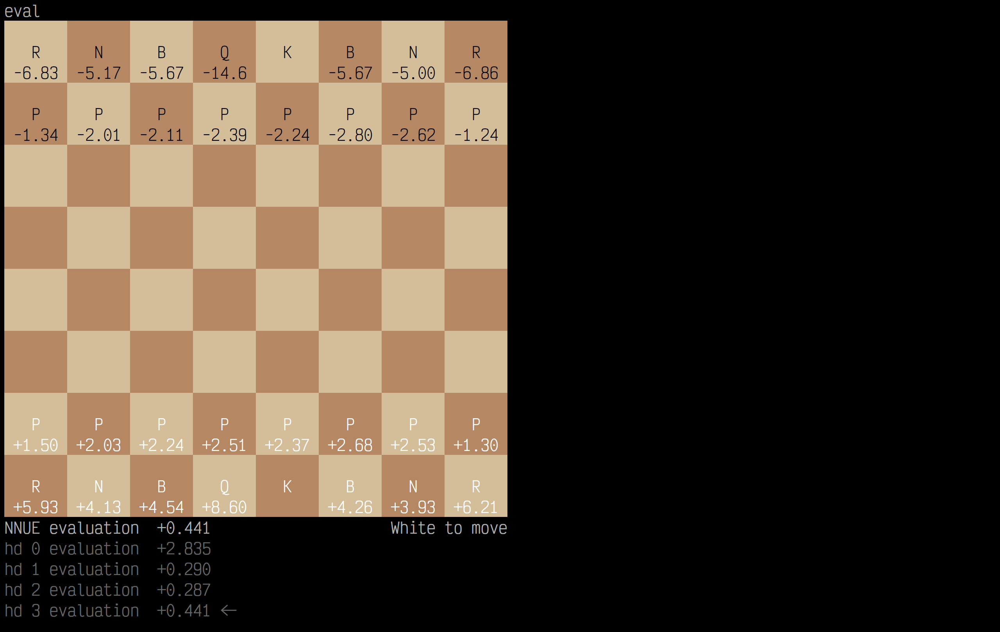
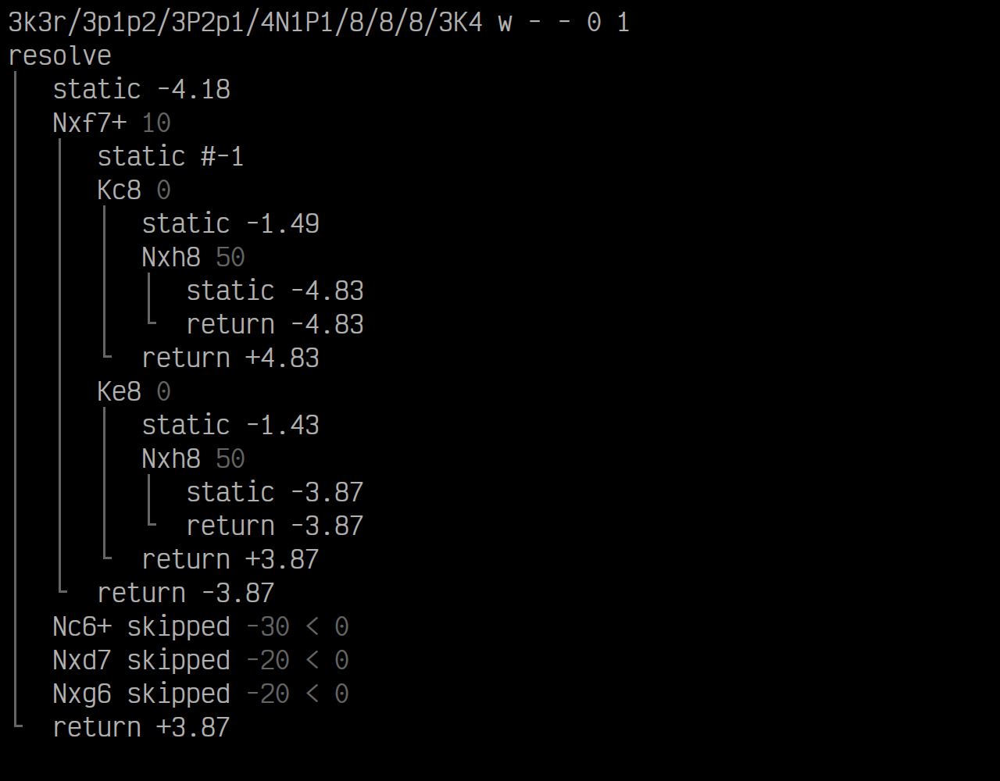
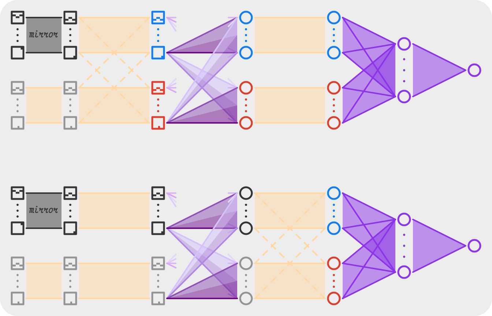
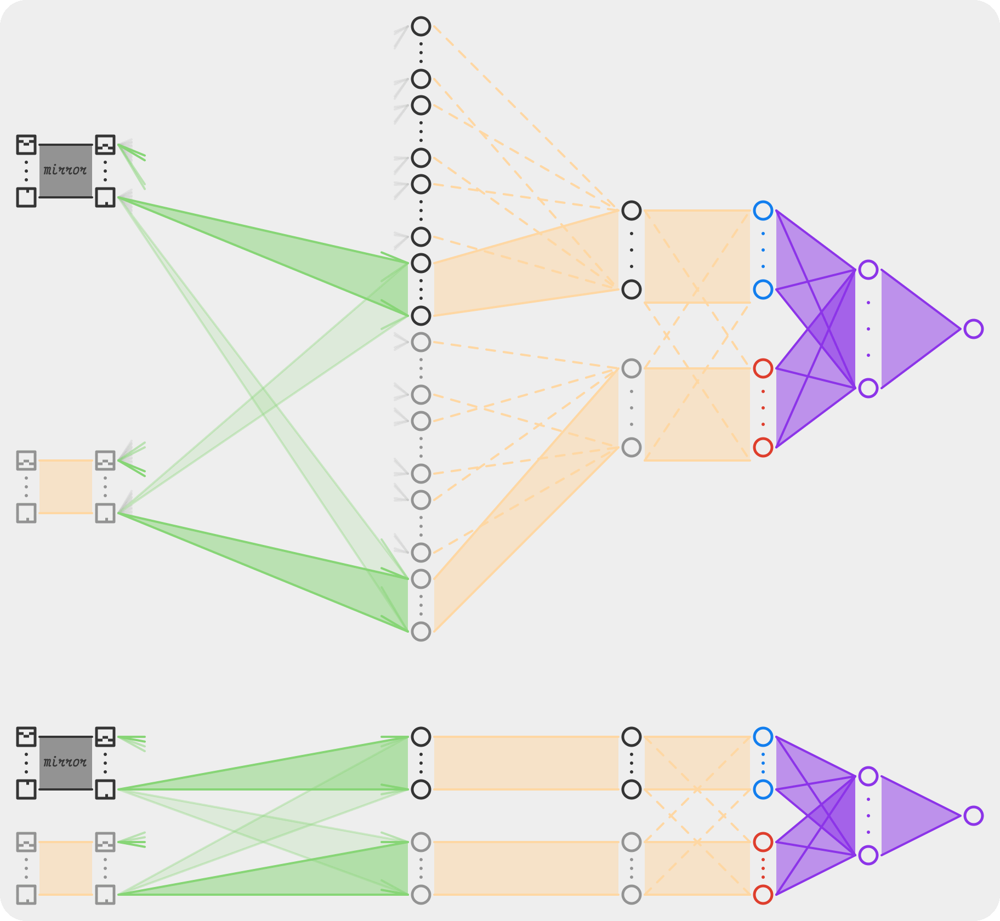
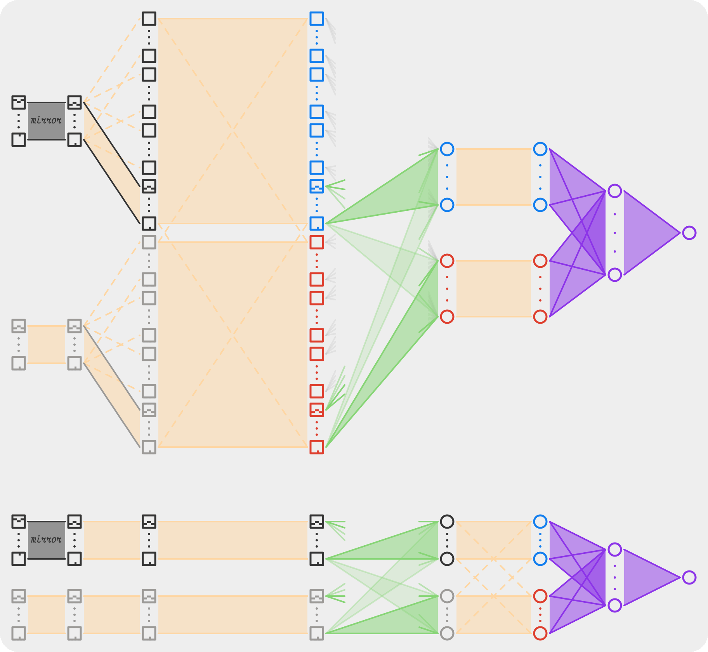

<div align="center">

# Expositor

</div>

<p align="center"></p>

_For the version currently playing in the Top Chess Engine Championship, see the
[tcec](https://github.com/expo-dev/expositor/tree/tcec) branch._

Expositor is a UCI-conforming chess engine for AMD&thinsp;64 / Intel&thinsp;64
systems. You can [play against her on Lichess](https://lichess.org/@/expositor)
or download a copy for local use.

The name “Expositor” comes from _exponent_ – the root of both is
[_expōnēns_](https://en.wiktionary.org/wiki/exponent#Etymology). An exponent is
one part of a floating-point number (along with a sign, significand, and radix).
My friend and I started chess programming at the same time; his engine is named
“Mantissa”, which is another name for a significand. The name “Expositor” also
contains the word “posit”, which is the name of
[another format](https://posithub.org/docs/posit_standard-2.pdf)
beside the standard IEEE 754 formats.

_Suppose I’m a new or aspiring engine developer. Do you’ve any advice?_&ensp;You
might find the [engine programming discord](https://discord.gg/qEWAGXczar) and
[chess programming wiki](https://www.chessprogramming.org) useful. I’d also
recommend finding a friend who you can share your hobby with – it’s a lot of
fun that way.

A trope of the engine programming community is that “no one’s as disdainful
of an engine as the developer themself”; engine programming seems to be rather
effective at engendering strong feelings of self-criticism. So in case you
need to hear it from someone: any goal of yours is a valid one (whether that’s
chasing Elo gains, wanting to learn stuff, or trying out new, weird, wonderful
ideas), and the performance or progress of your engine does not reflect your
self-worth in any way (nor is any certain indicator of what the future will
be like).

## Status

_Updated March 2024_

There are three features in progress:

- an alternative evaluator (along the lines of an HCE) from which her NNUE will
be re-bootstrapped,[^1]

- a proof number search,[^2] and

- a compact policy network.

For projects that haven’t been started yet, see the **Planned** section of this
readme.

[^1]: There are particular goals and constraints that I have for the alternative
evaluator and – since I expect that I won’t ever touch the evaluator again after
I’ve finished it – I want to get it right. I’ve started over multiple times and
thrown away most of what I’ve written, and I’ve lost count of the number of
versions there have been, but I do hope it will eventually be finished. It’s
unclear whether it will ultimately resemble traditional HCEs, which is why I’m
simply calling it “an alternative evaluator”. Once the alternative evaluator
is complete, it will take several additional months to train two or three
iterations of the NNUE.

[^2]: You can try this for yourself by entering, for example,
`n2Bqk2/5p1p/Q4KP1/p7/8/8/8/8 w - - 0 1` and then typing `proof`.
After a moment, she will print something like
`Searching... Proven. #+16 Qc8 Qe6+ Qxe6 fxe6 gxh7 Ke8 Kxe6 ...`.
You can ask her to search for a mate in 13 by typing `proof 13`,
and she will reply
`Searching... Proven. #+13 Qc8 Kg8 Bc7 Qxc8 gxf7+ Kh8 Be5 ...`.
This happens to be optimal for this position, so if you type `proof 12`,
she will exhaust the allocated memory arena before finding a solution
(because none exists): `Searching... Out of memory.`

_Will Expositor ever support FRC or DRFC?_&ensp;I’m very interested in
[chess 324](https://talkchess.com/forum3/viewtopic.php?f=2&t=80482), but I don’t
really like FRC, so no – I don’t expect Expositor will ever support FRC or DRFC.

_Why do people always assume you’re male?_&ensp;I’m not sure, but I suppose it’s
a reasonable guess given the current demographics of chess and programming.
Please feel free to refer to me however you’d like (_he, she,_ or _they_).

As always, stay safe, and thank you for your interest in Expositor!

## Description

### Interface

Expositor understands short algebraic notation and it can be used wherever
long algebraic notation can be used. Positions in FEN can be entered directly
(without the `position fen ` prefix) and moves and lists of moves can also
be entered directly (which will be applied to the current position).

When stderr is a terminal, Expositor will display formatted information
(via stderr) in addition to UCI output (via stdout).

<p align="center"></p>

There are other commands that might be helpful when using Expositor
interactively in a terminal. The `show` command will have her display the
current position:

<p align="center"></p>

The `eval` command will have her print her current static evaluation and
derived piece values:

<p align="center"></p>

The `resolve` command will have her display a quiescing search from the
current position:

<p align="center"></p>

For more information, see the **Usage** section of this readme, pass any command
line argument to Expositor, or use the `help` command when Expositor is running.

### Network Architecture

Note that this section isn’t meant to explain the details of efficiently
updatable neural networks (NNUEs); the figures are only meant as visual aids,
and the goal is just to provide a very cursory description of Expositor’s
network.

A simple symmetric NNUE has, in concept, the structure depicted at the top of
the following animation.
- Each square node represents a vector of 64 numbers, each 1 or 0, encoding
which squares on the board are occupied by a piece of a particular kind and
color.
- Each circular node represents a neuron, which sums its inputs, applies an
activation function (such as the ReLU function), and outputs a single number.
- An ellipsis indicates nodes which are concatenated together, of which some
are omitted (the uppermost leftmost pair of square nodes, for instance,
together represent a vector of 6×64 = 384 numbers).
- Square nodes colored white and black represent the white and black positions.
Circular nodes are colored white and black to distinguish nodes whose outputs
have the same meaning or interpretation but differ in that one describes white’s
perspective and one describes black’s perspective.
- Nodes colored red and blue represent the side to move and the side waiting,
respectively.
- The dark lines labelled “mirror” indicate that the elements of a vector are
shuffled so that the position encoded on the right is a vertically mirrored copy
of the position encoded on the left.
- The light yellow lines indicate nodes being moved or copied (that is, the
nodes on the left are the same nodes as on the right).
- Other colored lines indicate weights, which numbers on the left are multiplied
by to produce linearly scaled numbers on the right.

<p align="center"></p>

In practice, however, the structure on the bottom of the animation is what would
be implemented – the result is identical.

Expositor’s current network is somewhat more complicated:
- There are four different versions of the right half of the network (the second
layer and the output layer) called “heads“ in the source. Which version it is
that gets used depends on the number of pieces on the board.
- There are five different versions of the left half of the network (the first
layer). Which versions get used depends on the locations of the kings.
Specifically, the board (from each player’s perspective) is divided into five
king regions, and the left half of the network changes whenever a king leaves
one region and enters another.

The dependence upon king region deserves illustration. As before, the structure
depicted at the top of the animation corresponds to what is happening
conceptually, and the structure at the bottom of the animation depicts the
equivalent process that is actually implemented.

For the sake of space, the animation depicts a network with four king regions,
rather than five. The four sets of colors from green to blue correspond to the
four king regions.

<p align="center"></p>

Here is another animation of the same network with a slightly different
depiction:

<p align="center"></p>

In Expositor’s current network, the location of the white king is used to
select the weights used to evaluate both white and black’s position from white’s
perspective. However, one can imagine a network in which the location of the
white king determines the weights used to evaluate white’s position from white’s
perspective and the location of the black king determines the weights used to
evaluate black’s position from white’s perspective. (Note that evaluating
black’s position from white’s perspective is different than evaluating black’s
position from black’s perspective, even if both are predicated on the position
of black’s king!) Here is an animation of such a network:

<p align="center"></p>

Pay close attention to the green–blue colors. In the network used by Expositor,
the incoming weights connected to the circular nodes are the same color whether
they come from the the position of the side to move or the side waiting (the
square nodes). In this network, however, those colors can be different. Instead,
the outgoing weights connecting to the square nodes are the same color.

I haven’t tried this; for all I know, it works better!

### Move Generation

The core of move generation is variable-shift perfect hashing. (There are
several alternatives using pext in the source, but they are currently
commented out, since they didn’t cause significant performance improvement.)

Expositor generates only legal moves by calculating pins and dangerous squares
for the king. She also calculates “vantage” and “waylay” squares (the terms used
in the source) in order to annotate each generated move as giving a direct or
discovered check or both. This information is used in the quiescing search (and
in the future may also be used in move scoring).

When a move is applied, she sets the flag indicating whether the side to move is
in check based on the move annotation, and so a second check calculation isn’t
performed redundantly.

Move scoring is staged, so she won’t bother scoring quiet moves if she doesn’t
have to. Moves are sorted using a selection sort, so she won’t sort more moves
than she has to.

Legal-only move generation and direct-&thinsp;/&thinsp;discovered-check
annotations are some of the more unusual features of Expositor.

### Quiescing Search

Note that, in the source, this is currently called the “resolving” search,
since its purpose is to resolve tactical sequences. The “length” of a node in
a quiescing search tree is the distance from the root of that quiescing search
(increasing by 1 per ply).[^3][^4]

[^3]: The “height“ of a node in the main search tree or in a quiescing search
tree is the distance from the root of the _main_ search. So if the root of a
quiescing search (with length 0, by definition) has height 17, then a node
within that quiescing search tree with length 2 would have height 17 + 2 = 19.
Like length, height always increases by 1 per ply.

[^4]: The “depth” of a node is a fairly arbitrary number that usually
decreases by 1 per ply along the principal variation (and by a greater amount
along other lines). Depth is only defined for nodes in the main search tree
(just as length is only defined for nodes in a quiescing search tree).
A node in the main search tree with depth 0 is the root of a quiescing search
tree, and so also has length 0 – these are the only nodes that are part of both
the main search tree and a quiescing search tree.

The quiescing search varies in selectivity in a way that is fairly
straightforward in principal but rather tedious to describe.

The move generator itself has three levels of selectivity:
- Everything (quiet moves, checks, captures, and promotions),
- Active (checks, captures, and promotions), and
- Gainful (captures and promotions).

The _gained_ array is a list of boolean values that describes the moves of the
current variation, where <i>gained</i>[<i>length</i>] is true when the side to
move at the node with length _length_ is in check or when the move made by the
side to move was a capture or promotion.

The selectivity of the move generator at a node is
- if the side to move is in check, then Everything;
- otherwise, if _length_ &ge; _B_, then Gainful;
- otherwise, if _length_ &ge; _A_, then
    - if <i>gained</i>[<i>length</i>−2] then Active else Gainful;
- otherwise Active;

where _A_ and _B_ are small constants and _A_ &lt; _B_.

Summarily, the quiescing search will consider noncapture checks unless
a node is far from the root of the quiescing search or the side to move gave
a check on its previous turn that also wasn’t a capture. (This prevents long
sequences of fruitless checks.)

Additionally, when the side to move is not itself in check, some candidate
moves may be skipped:
- Losing captures are ignored and, once _length_ &ge; _C_ (where _C_ is some
small constant), neutral captures are ignored as well unless they give check.
- Captures are subject to delta pruning unless they give check.
- Noncapture moves that put a piece en prise are ignored.

However, promotions and moves that give discovered check are always considered
(even if static exchange analysis predicts they are bad).

The fact that all moves are considered when the side to move is in check means
that the quiescing search can return mate scores.

### Main Search

Expositor has a fairly standard principal variation search (a variation of
α-β search) with aspiration windows. When there is more than one search thread,
jitter is introduced by varying the aspiration window per thread.

**Extensions and Reductions**&ensp;internal iterative reduction,
null-move reduction, check extension, singular-move extension, late-move
reduction (quiet moves only), history reduction (quiet moves only)

**Pruning Rules and Heuristics**&ensp;mate-distance pruning, reverse futility
pruning, null-move pruning, multicut, futility pruning

**Move Ordering**&ensp;transposition table hints, killer move heuristic,
static exchange analysis (captures only), history heuristic (quiet moves only)

### History Table

History tables are indexed by color, piece, and destination square. Each entry
is a pair of scores ⟨_a, b_⟩ where the deep score _a_ correlates with cutoffs
near the root of the search tree and the shallow score _b_ correlates with
cutoffs near the extremities. <!--In simplified form,
$${\rm lookup}(\langle a, b\rangle, h) = (a\times(32-h) + b\times h) / 32$$
$${\rm update}(\langle a, b\rangle, h) = \langle a\pm(32-h), b\pm h\rangle$$
where $h$ is the height (the distance from the root of the search tree) clipped
to the range $0$ to $32$.-->

I’m planning to replace the current scheme with an idea I had inspired by the
GEHL and TAGE branch predictors.[^5]

[^5]: See [this paper](https://jilp.org/cbp/Andre.pdf) and
[this paper](https://jilp.org/vol8/v8paper1.pdf).

I’ve tried introducing countermove, follow-up, and capture history tables, but
they had little effect on playing strength at the time. I’m planning to try them
again some time.

### Transposition Table

Each entry stores the generation number of the search when it was written.
(The generation number is incremented at the beginning of the top-level
search routine.) The current policy is to unconditionally replace entries
from previous generations. Transposition table access is lockless.

The `Persist` option can be used to have Expositor disregard entries with
old generation numbers during lookup, which will cause single-threaded
searches to be deterministic. (This is equivalent to clearing the
transposition table before each search, but without the overhead.)

The ability to disable persistence is perhaps one of the more unusual
features of Expositor.

### Time Control

The earliest versions of Expositor used a [model based on the log-normal
distribution of the length of chess games](https://expositor.dev/pdf/movetime.pdf)
which depended only on the number of moves played so far.
I then wrote a rather complicated
[empirical model](https://github.com/jtheardw/mantissa/blob/master/src/time.rs)
that is used in Mantissa, which depends on the number of moves played so far
and the material difference between the two sides.

Expositor now uses a simple linear model that depends on the number of moves
played so far and the number of men left on the board, fit to a selection of
TCEC games. Differentiating between pieces and pawns, or including the material
difference between the two sides, did not meaningfully improve the regression.

### Internal Tablebases

On startup, Expositor generates internal 3-man tablebases with WDL and DTM
information. This takes approximately a quarter of a second.

This is one of the more unusual features of Expositor.

### Quick Format

Training data is stored in a fixed-length, 40-byte format rather than in FEN
or EPD. In the source this is named the “quick” format, since it takes less
time to read from disk and deserialize. (It also takes less space.)

<!--```
  fen   rnbqkbnr/pppppppp/8/8/8/8/PPPPPPPP/RNBQKBNR w KQkq - 0 1
quick   008F4307251689ABCDEFyxu$wzv&mnopqrst::::

  fen   rk6/p1r3p1/P3B1Kp/1p2B3/8/8/8/8 w - - 0 1
quick   0080k:::ai::e:::::::v:ou::::Xlms::::::::
```-->

### Network Trainer and Data Generation

The network trainer for Expositor’s value network is built into Expositor,
as well as a self-play and scoring routine for generating training data.

### Miscellania

There is a collection of scripts I’ve written that will eventually make their
way into the public repository, such as the Lichess client that is used for the
[Expositor](https://lichess.org/@/expositor) and
[Simplexitor](https://lichess.org/@/simplexitor) accounts, the programs used
to find the constants used in move generation, a pentanomial Elo model, and
the SPSA optimizer used to tune Expositor’s search constants.

At one point, I was working on a better [specification of the Universal Chess
Interface](https://expositor.dev/uci). Several people were supportive (and I’m
very grateful for that – thank you!) but there were also some very discouraging
responses, enough so that I put it aside.[^6]

[^6]: I may eventually pick this up again and publish a second draft. If you
have any comments on the first draft, I’d love to hear them; please send an
email to uci@expositor.dev.

## Releases

If you know the generation or microarchitecture of your processor, try using
a binary from the `amd` or `intel` directory of a release archive.[^7] If you
don’t know the microarchitecture of your processor but you do know which
features it supports, try using a binary from the `generic` directory of a
release archive. See the [file named `extensions.md`](extensions.md) in this
repository for more information about AMD and Intel microarchitectures and the
features they support.

[^7]: I’ve attempted to include binaries for most consumer laptop and desktop
hardware but not mobile or server platforms. If you have an Atom, Xeon, or Epyc
processor, for example, and want a targeted binary, you’ll need to compile from
source. Feel free to reach out to me for help or if you’d like me to include a
binary for your platform in releases.

## Building

If you’d like to compile Expositor from source, you will need to use a recent
nightly toolchain.

To build Expositor on Windows, run the `build.bat` script. (This sets the
`VERSION`, `BUILD`, and `RUSTFLAGS` environment variables and then invokes
`cargo build --release`.)

To build Expositor on Linux, run the `build` script. (This needs to be done from
within the repository, since it uses Git to automatically determine the version
number.)

## Usage

There are no command line options, but the engine can be configured with these
UCI options:
```
setoption name Hash value <num>
  Set the size of the transposition (in MiB) to <num>.

setoption name Threads value <num>
  Use <num> search threads. Performance will suffer if this is set larger
  than the number of logical processors on your machine, and depending on
  your processor, may suffer if this is set larger than the number of
  physical cores.

setoption name Overhead value <num>
  Set the move overhead (used in time control calculations) to <num>
  milliseconds. "Overhead" refers to the time spent per move on I/O
  operations between the engine and your client or user interface, any
  time spent on network requests that is not corrected by the server
  (if the engine is playing online), and any other latency that uses
  time on the clock. It is important that this is not set to a value
  less than the true overhead, or the engine will have a increased
  risk of flagging.

setoption name Persist value <bool>
  Allow the engine to reuse transposition table entries from previous
  searches. When set to false, singlythreaded searches are deterministic
  and repeatable, regardless of the state of the transposition table.
  When set to true, search results may depend upon previous searches.
  (This is achieved by tagging each table entry with a generation and
  does not incur the penalty of actually zeroing the table.) Setting
  this option to true generally increases playing strength.

setoption name SyzygyPath value <path>
  Inform the engine that Syzygy tablebase files are located in the
  directory <path> and enable the use of the Syzygy tablebases if the
  files can be loaded.
```
As well as some nonstandard commands:
```
fen           print the current position in Forsyth-Edwards notation
eval          print the static evaluation of the current position
flip          switch side to move in the current position
load <file>   load a set of neural network weights and begin using them

help          prints this help message
license       prints information about the license
exit          alias for the UCI command "quit"
```
These commands are also available when stderr is a terminal:
```
show        displays a human readable board with the current position
eval        displays NNUE-derived piece values and the static evaluation
resolve     display the tree of a quiescing search from the current position
```
Expositor will automatically detect whether stderr and stdout are connected to
a terminal when running on a Linux system, but assumes when running on Windows
that neither stderr nor stdout are connected to a terminal. This can, however,
be explicitly overridden with the following commands:
```
isatty stderr <bool>
  Inform the engine that stderr is (or is not) connected to a terminal,
  or to behave as if stderr is (or is not) connected to a terminal.

isatty stdout <bool>
  Inform the engine that stdout is (or is not) connected to a terminal,
  or to behave as if stdout is (or is not) connected to a terminal.

isatty <bool>
  Shorthand to set both isatty stderr and isatty stdout.
```
Expositor is lenient when reading moves – short algebraic notation can be used
wherever long algebraic notation is expected. The current position can also be
set by entering FEN directly (without having to preface it by `position fen `).

## Issues

If you find any bugs or have any questions, please file an issue on Github or
send a message to help@expositor.dev.

## Versions

| Version | Release Date | Notes                                         |
|:-------:|:------------:|:----------------------------------------------|
|  4WR02  |   2 Mar 2024 | new value network architecture, quantization  |
|  2BR17  |  17 Sep 2022 | fixes, tuned search, internal 3-man tablebase |
|  2WN29  |  29 May 2022 | fixes, better time control, cache persistence |
|  2WQ23  |  23 Feb 2022 | first public release                          |

## Planned

- **Search Rewrite**&ensp;Expositor’s main search has always been her weak point
(and the part that has received the least time and attention). I’d like to start
over and write a much more selective search.

- **Experimental Search Algorithms**&ensp;I’ve been thinking about estimating
the distribution of error during search since I started chess programming and
at one point it was my primary focus.

- **Syzygy Tablebase Support**&ensp;I’d like to write my own implementation of
the Syzygy tablebase probing routines so that Expositor once again has no
dependencies and includes no external code.

## Acknowledgments

Support for Syzygy tablebases is currently provided by means of the Fathom
library; for details, see the readme and license in the `fathom` directory.

The network used in the first public versions of Expositor was trained on
approximately 220 million positions. Four sources were used in the creation
of those training positions:
the [Lichess database](https://database.lichess.org/),
the [Lichess elite database](https://database.nikonoel.fr/),
old [Ethereal datasets](http://talkchess.com/forum3/viewtopic.php?t=75350),
and the [TCEC games archive](https://github.com/TCEC-Chess/tcecgames).
These were processed by Expositor with her quiescing search and the leaves from
those searches were then scored with a gold-standard engine (specifically,
[Stockfish](https://github.com/official-stockfish/Stockfish) 13,
[Komodo](https://komodochess.com) 14, or
[Leela Chess Zero](https://github.com/LeelaChessZero/lc0)). Those scored leaves
were then filtered and the network was trained on the selected positions.

The latest network was trained on approximately 810 million positions from both
standard and chess 324 games. This dataset includes the original 220 million
positions; the remainder (about 590 million positions) were generated by
Expositor 2 self-play or positions from Expositor 0, Expositor 1, and Admonitor
self-play games that were then scored by Expositor 2. Openings were created
by randomly playing moves from the starting position that kept the advantage
within approximately ±2 pawn (with more plausible moves weighted more heavily).

Most of the positions used for perft tests were from the
[Zahak](https://github.com/amanjpro/zahak) repository.

Particular thanks to the author of
[Mantissa](https://github.com/jtheardw/mantissa) for help with main search.
Many techniques were implemented from his verbal descriptions during our
conversations.

## Philosophy

There have been a few tenets of my work on Expositor:

- _Interestingness_&ensp;I’d like Expositor to be interesting. She’s as much a
platform for me to try things as she is an engine, so this tends to happen
naturally.

- _Trying things myself_&ensp;I exchange ideas and results with the author of
Mantissa, but I’m otherwise an entirely solo developer. It’s quite rare that I
read other engines’ source. (This isn’t ideological; I just don’t especially
enjoy reading most code. I wish I did read other engines’ source more often,
though.) I also write all the infrastructure myself: the network trainer, the
SPSA tuner, the programs that find constants for move generation, the self-play
and scoring routines to generate training data, &amp;c.

- _Absence of dependencies or external code_&ensp;The use of Fathom is
(hopefully) a temporary exception.

<!--
- _Understanding my own code_&ensp;It’s important to me be very intentional
and to be mindful of the assembly that is ultimately emitted (which means lots
of [Compiler Explorer](https://godbolt.org)). I want the programs I write (that
will be used by other people) to be correct by construction and I want to have
at least informal proofs in mind as I write, which means having a complete
understanding of the source I’m working with (I’ve often been frustrated at the
extreme difficulty in knowing the runtime behavior of selective
α&thinsp;/&thinsp;β searches, since they’re so absurdly stateful). That said,
Expositor likely has bugs, there are still performance suboptimalities (besides
the intentional ones sacrificed for aesthetic value), and there are spots where
I indulge in some bad practices. And of course, since Expositor is a work in
progress and a test bed for experimentation, I’ll continuously be creating new
messes while I clean up old ones.
-->

And an aspiration:

- _Not suffering_&ensp;Engine development is something I nominally do for fun,
so I want to actually enjoy it! Although I sometimes have to make myself finish
work that I started, I’ll generally do whatever I find interesting. The pursuit
of playing strength is terribly consuming, and I usually don’t enjoy
competitions, so I try not to think about that.

## Terms of Use

Expositor is free and distributed under the terms of version 3 of the GNU Affero
General Public License (AGPL). You are welcome to run the program, modify it,
copy it, sell it, or use it in a project of your own.

If you distribute the program, verbatim or modified, you must provide the source
and extend to anyone who obtains a copy the same license that I am granting you.

If users can interact with a modified version of the program (or a work based on
the program) remotely through a computer network, you must provide a way for
users to obtain its source.

For more details, see the file named “license” in the root directory of this
repository.

<!--
Whether the GNU licenses are in fact licenses or contracts may be a matter of
[legal uncertainty](https://writing.kemitchell.com/2023/10/13/Wrong-About-GPLs).
Regardless of the AGPL’s capacity as a license, use of the contents of this
repository is explicitly covered by contract (possibly in addition to being
covered by license) hereby: the author, Kade, offers to you the rights and
permissions described in the AGPL in exchange for your compliance with the
restrictions and requirements described in the AGPL; exercising any of those
rights or permissions constitutes acceptance of this offer. Additionally, by
accepting this offer, you agree that all legal persons are third-party
beneficaries of this contract.
-->
