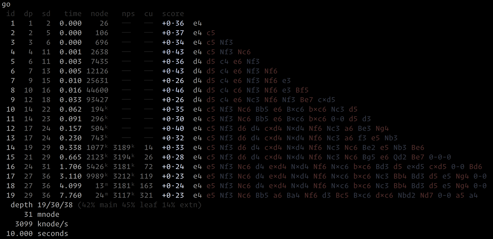
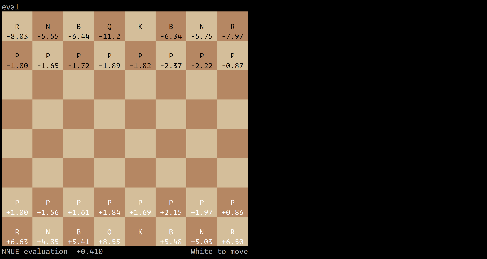
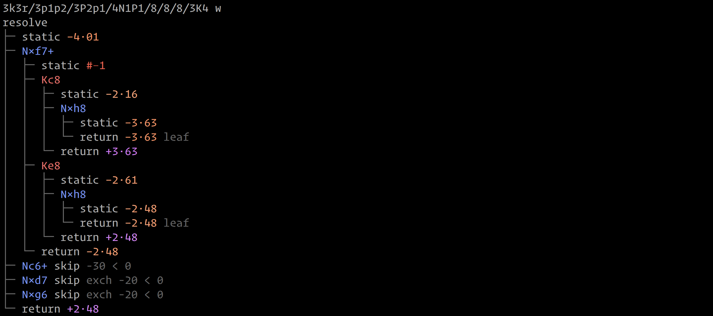

Expositor is a UCI chess engine for AMD&thinsp;64 / Intel&thinsp;64 systems.
You can [play against her on Lichess](https://lichess.org/@/expositor)
or download a copy for local use.
[Notes on engine development](https://expositor.dev/notes) are published on
her site.

## Description

Expositor understands short algebraic notation and it can be used wherever
long algebraic notation can be used. Positions in FEN can be entered directly
and moves can also be entered directly (which will be applied to the current
position). Only the first two fields of an FEN record are required.

Expositor writes UCI output to stdout and formatted output to stderr.
By default, when stderr is a terminal, Expositor will display formatted output,
and when stdout is a terminal, Expositor will suppress UCI output.

There are other commands that might be helpful when using Expositor
interactively in a terminal. The `show` command will have her display the
current position:

The `eval` command will have her print her current static evaluation and
derived piece values:

The `resolve` command will have her display a quiescing search from the
current position:

For more information, pass any command line argument to Expositor or use the
`help` command when Expositor is running.

## Building

If you’d like to compile Expositor from source, you will need to use a recent
nightly toolchain.

To build Expositor on Windows, run the `build.bat` script. (This sets the
`VERSION`, `BUILD`, and `RUSTFLAGS` environment variables and then invokes
`cargo build --release`.)

To build Expositor on Linux, run the `build` script. (This needs to be done from
within the repository, since it uses Git to automatically determine the version
number.)

## Issues

If you find any bugs or have any questions, please file an issue on Github or
send a message to help@expositor.dev.

## Terms of Use

Expositor is free and distributed under the terms of version 3 of the GNU Affero
General Public License (AGPL). You are welcome to run the program, modify it,
copy it, or use it in a project of your own.

If you distribute the program, verbatim or modified, you must provide the source
and extend to anyone who obtains a copy the same license that I am granting you.

If users can interact with a modified version of the program (or a work based
on the program) remotely through a computer network, you must provide a way
for users to obtain its source.

For more details, see the file named “license” in the root directory of this
repository.
